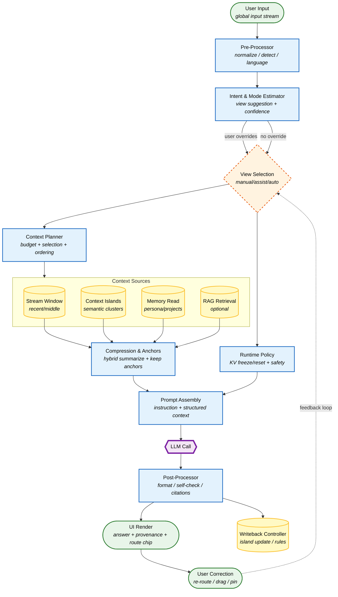

# ContextOS 白皮书
# 从河流到画布：一次把“上下文”从提示词里解放出来的尝试

一切的起点，看起来像一句漂亮的比喻：传统对话是一条河流，而人类的思维更像群岛。你不满足于把对话继续拉长，不满足于用更大的窗口把更多 token 塞进去，因为你真正撞上的，是更底层的东西：注意力机制本身并不承诺“越长越好”，它只承诺“在这一刻，我会按某种分布去关注你给我的东西”。于是 lost in the middle、复读而不是学习、上文遗忘、语境漂移、上下文异常时模型退回训练分布的固有腔调，统统不是偶发现象，而是一种结构性的副作用——它们会在不同长度、不同模型、不同推理风格里以不同面目反复出现。

在这样的语境下，“把系统做成一个记忆系统”就显得既诱人又危险。mem0、memOS 这类方案已经把“记忆工程”铺成了一个专门领域：分层记忆、写入策略、召回策略、图谱与 RAG、多 agent、KV cache……它们确实解决了很多实际问题，也确实复杂得多。然而当你把自己的动机摊开来，你会发现你追的并不是“更像一个稳定的人格”的 AI，而是一个更具体也更锋利的目标：让模型在长对话与多任务之间仍然能保持一致的工作方式，让它不至于在上下文被污染时暴露出不可控的生成偏好，让它能在“调试态”“发散态”“批判态”“总结态”之间切换得像 IDE 切模式一样可靠。

于是谈“群岛”只是第一层。真正要动刀的，是“上下文”这个词本身。

------

## 不是更长的上下文，而是更可控的注意力视角

如果把所有问题都归因于“上下文不够长”，那解决方案就会天然滑向两条路：要么堆窗口，要么堆记忆。两条路都能带来提升，但都无法触及一个更刺眼的事实：哪怕你把窗口做到百万 token，模型仍然要在一次调用里用同一套注意力机制、同一种生成策略去面对混杂的任务信号。你从代码调试跳到午餐计划再跳回来，在人类端这是一种自然的意识切换；在模型端却是一场输入分布的混战。它不只是“记不记得”，而是“该以什么方式去理解”，以及“到底应该忽略什么”。

这一步的转折非常关键。你最初把对话从“河流”改写为“群岛”，直觉是对的，但它仍然把岛屿理解成话题容器。进一步看，真正值得空间化的并不是话题，而是模型的认知运行方式。换句话说，问题并不在于你缺少更多文本记忆，而在于你缺少一个中间层，能够在每次调用前决定：此刻要让模型以怎样的方式工作，要让它看到哪些内容，要让它看不到哪些内容，要不要让它冻结住某些稳定约束，防止风格漂移和复读污染。

当你问出那句极其关键的问题：“这不就是随时切换 system prompt 吗？”答案终于变得清晰：底层当然仍然是 prompt 与 context，但你真正要做的并不是“换一段更聪明的提示词”，而是让提示词退居为策略对象的一部分，让上下文从线性对话历史变成可被调度的资源。Prompt 只能描述“请你这样做”，它很难控制“系统如何把世界喂给你”。而你要的，是后者。

因此，“View”这个词的意义开始浮现。它不是话题块，不是对话块，不是更华丽的系统提示词，而是一次模型调用的认知运行态：它包含指令，但更重要的是包含边界、包含选择与排除、包含预算、包含冻结与复位、包含检索与记忆的读写策略。它不只改变模型说话的腔调，更改变模型在这一刻如何被使用。

你后来把这个形态叫作 AI 画布。这个名字如果只落在 UI 上，会显得浪漫而虚；但如果落在“上下文调度范式”上，它就变得很硬：画布不是为了展示节点，而是为了把“认知视图”变成可操作对象，把“上下文配方”从隐形的 prompt 变成可解释、可修正、可复用的运行实体。

------

## 无感与可控的悖论，靠的不是更聪明的路由，而是“二阶透明”

当我们回到最初设定的两大终极挑战，“无感”与“可控”看上去像一场注定互斥的拉扯：路由太自动，用户失控；路由太手动，用户疲劳。最直觉的答案是提高意图识别精度，做更强的 semantic routing，让系统在回车瞬间就判断输入属于 A、B、还是新 C。听起来很对，做起来很难，更重要的是，它在认知层面并不总是合法。因为大量输入在用户自己脑中也尚未确定归属，它们是过渡态意识，是“我还没想清楚”。你若强迫即时塌缩，系统就会在最不该自信的时候自信。

因此更稳的解决方式，不是去追求一种完美的即时分类，而是承认不确定性，把“路由”从输入阶段挪到调用阶段，让系统默认不打扰、但随时可见可改。也就是说，透明不是强迫用户每次选择分类，而是让用户在需要的时候能够立刻看见系统即将做什么，并以最低成本纠正它。这种透明是一种二阶能力：平时像空气，不用时不出现；要用时，一眼能懂，一键能改，而且纠正本身会成为路由器学习的信号。

碎片化灾难也在同一逻辑里获得新解。碎片并不总是算法太敏感造成的，很多时候它是系统价值观在诱导用户“把每个念头都变成一个实体”。因此与其默认切碎，不如让碎片先进入低压力缓冲，让聚合发生在回顾或调用的上下文规划阶段。岛屿不必是你输入时就被系统判定的“分类盒子”，而更像是系统在长期互动中逐渐识别出的“语义张力场”：哪些主题反复出现，哪些约束一再被强调，哪些思路正在漂移成新的阶段。漂移不是 bug，而是状态；重要的是让漂移可见、可操作、可撤回。

在这条线上，Context Painting 也自然从“圈选多个对话块拼接 prompt”升级为“推理层融合”。所谓化学反应，不在于文本拼接，而在于让不同认知模式以可控方式参与一次回答：发散视图负责提出候选，批判视图负责审查约束，合成器把冲突折叠成最终方案，并把证据链与风险提示留在可追溯的 provenance 里。这样它就不再是一种一次性的灵感技巧，而是一条可复用的认知流水线。

------

## ContextOS 的形态：它不是聊天机器人的替代品，而是一层上下文调度的操作系统

如果把 ContextOS 当成“更聪明的 ChatGPT”，它几乎注定走向复杂性陷阱：你会把越来越多的能力塞进一个对话界面，希望它永远正确地理解你，而它永远会在边缘处失误。相反，把它当成“LLM 的控制台”时，系统的职责就清晰起来：不是替你思考，而是让模型的认知行为可控、可解释、可组合，让你在长周期任务里不被模型的固有倾向牵着走。

于是一个新的产品类别出现了：Cognitive Orchestration Tool。它不像 Notion 那样从文档出发，不像 Roam 那样从链接出发，也不像 ChatGPT 那样从对话出发，它从“模型调用之前的那一刻”出发：在那一刻，世界应该如何被呈现给模型，模型应该以哪种运行态去理解它。

这也解释了为什么 View 并不只是 prompt + context。它当然会落回 prompt 与上下文，但它把 prompt 变成配置的一部分，把上下文变成被选择、被压缩、被加权的材料。View 的核心是策略，是边界，是运行控制。它像车的驾驶模式，而不是贴在仪表盘上的便签。便签可以提醒司机开慢点，但驾驶模式能改变油门映射、牵引力和悬挂；你要做的是后者。

------

## 让架构说话：Orchestrator 的调用路径

当哲学被落实为系统，你会发现整个 ContextOS 的关键并不在“记忆存了多少”，而在“每次调用如何装配一次稳定的世界”。这条链路可以被画成一条清晰的调用路径，它把“输入”“视图选择”“上下文规划”“压缩与锚点”“运行时策略”“模型调用”“回写与纠正”连成闭环。下面是我们讨论过的 Orchestrator 流程图，它体现的不是 UI，而是一次模型调用在系统层面的真实脑回路。



在这条路径里，真正用来对抗 lost in the middle 的不是“更长的历史”，而是 Context Planner：它在预算里分配权重，把锚点前置，把关键约束保留为稳定片段，让模型每次都能在正确位置看到正确的东西。防止风格漂移的不是“再强调一次你要严谨”，而是 Runtime Policy：冻结指令与锚点、必要时软复位噪声、控制检索是否参与、限制扩写倾向。最关键的一点也在这里变得具体：纠错不是失败，而是信号。用户把一句输入拖回正确岛屿、把一个锚点钉住、把某个岛屿排除出本次配方，这些操作不只是 UI 交互，它们是系统学习“你如何使用上下文”的训练数据，但只训练路由与调度，不去妄图训练模型本体。

------

## View 作为一等公民：把“提示词”降级成字段，把“运行态”提升成对象

要让 View 真正成为可编辑、可继承、可组合的实体，就需要一个正式的规格。我们在对话中最终把 View 写成一个可版本化的 Schema：它包含指令与风格，但更核心的是上下文选择、压缩预算、稳定锚点、记忆读写策略、工具与检索策略、KV 冻结/复位策略、路由模式与置信阈值，以及可选的混合与冲突解决方式。它的意义在于：你可以用它生成 View 编辑器，可以用它做继承合并，可以让 Orchestrator 直接消费它。View 不再是“写几句 prompt”，而是“定义一次模型调用的认知配置”。

下面这份 JSON Schema 是我们构建这一切时的“可执行宪法”。它看似很长，但它把复杂性集中在一个地方：你可以删字段做轻量版，也可以扩字段做专业版；重要的是它把系统从“靠一段文本隐式控制”升级为“靠结构化策略显式控制”。

```json
{
  "$schema": "https://json-schema.org/draft/2020-12/schema",
  "$id": "https://contextos.ai/schemas/view.schema.json",
  "title": "ContextOS Cognitive View",
  "type": "object",
  "required": ["id", "version", "name", "policy"],
  "additionalProperties": false,
  "properties": {
    "id": { "type": "string", "minLength": 1 },
    "version": { "type": "string", "pattern": "^[0-9]+\\.[0-9]+\\.[0-9]+$" },
    "name": { "type": "string", "minLength": 1 },
    "description": { "type": "string" },
    "status": { "type": "string", "enum": ["active", "inactive", "frozen", "archived"], "default": "inactive" },
    "inherit": {
      "type": "object",
      "additionalProperties": false,
      "properties": {
        "base_view_id": { "type": "string" },
        "merge_strategy": { "type": "string", "enum": ["override", "deep_merge", "additive"], "default": "deep_merge" }
      }
    },
    "policy": {
      "type": "object",
      "required": ["instruction", "reasoning", "context", "memory", "tools", "runtime"],
      "additionalProperties": false,
      "properties": {
        "instruction": {
          "type": "object",
          "required": ["system", "developer"],
          "additionalProperties": false,
          "properties": {
            "system": { "type": "string" },
            "developer": { "type": "string" },
            "style": {
              "type": "object",
              "additionalProperties": false,
              "properties": {
                "tone": { "type": "string", "default": "neutral" },
                "verbosity": { "type": "string", "enum": ["low", "medium", "high"], "default": "medium" },
                "format": { "type": "string", "default": "markdown" },
                "language": { "type": "string", "default": "zh" }
              }
            }
          }
        },
        "reasoning": {
          "type": "object",
          "required": ["mode"],
          "additionalProperties": false,
          "properties": {
            "mode": { "type": "string", "enum": ["strict", "explore", "critic", "plan", "summarize", "teach", "debug"] },
            "self_check": {
              "type": "object",
              "additionalProperties": false,
              "properties": {
                "enabled": { "type": "boolean", "default": false },
                "passes": { "type": "integer", "minimum": 0, "maximum": 3, "default": 0 },
                "criteria": { "type": "array", "items": { "type": "string" } }
              }
            },
            "constraints": {
              "type": "object",
              "additionalProperties": false,
              "properties": {
                "no_hallucination": { "type": "boolean", "default": true },
                "cite_sources_when_available": { "type": "boolean", "default": false },
                "avoid_style_drift": { "type": "boolean", "default": true }
              }
            }
          }
        },
        "context": {
          "type": "object",
          "required": ["selection", "compression"],
          "additionalProperties": false,
          "properties": {
            "selection": {
              "type": "object",
              "required": ["sources", "allow", "deny", "weights"],
              "additionalProperties": false,
              "properties": {
                "sources": {
                  "type": "array",
                  "items": { "type": "string", "enum": ["stream", "islands", "memory", "rag", "user_pins"] },
                  "default": ["stream", "islands"]
                },
                "allow": { "type": "array", "items": { "type": "string" }, "default": [] },
                "deny": { "type": "array", "items": { "type": "string" }, "default": [] },
                "weights": {
                  "type": "object",
                  "additionalProperties": { "type": "number", "minimum": 0, "maximum": 1 },
                  "default": { "stream": 0.4, "islands": 0.4, "memory": 0.1, "rag": 0.1 }
                },
                "windowing": {
                  "type": "object",
                  "additionalProperties": false,
                  "properties": {
                    "recent_turns": { "type": "integer", "minimum": 0, "default": 8 },
                    "middle_turns": { "type": "integer", "minimum": 0, "default": 20 },
                    "lost_in_middle_guard": { "type": "boolean", "default": true }
                  }
                }
              }
            },
            "compression": {
              "type": "object",
              "required": ["strategy"],
              "additionalProperties": false,
              "properties": {
                "strategy": { "type": "string", "enum": ["none", "summary", "extractive", "semantic_map", "hybrid"], "default": "hybrid" },
                "budget": {
                  "type": "object",
                  "additionalProperties": false,
                  "properties": {
                    "max_tokens": { "type": "integer", "minimum": 256, "default": 4000 },
                    "reserve_for_user": { "type": "integer", "minimum": 64, "default": 512 }
                  }
                },
                "stable_anchors": { "type": "array", "items": { "type": "string" }, "default": [] }
              }
            }
          }
        },
        "memory": {
          "type": "object",
          "required": ["read", "write"],
          "additionalProperties": false,
          "properties": {
            "read": {
              "type": "object",
              "additionalProperties": false,
              "properties": {
                "enabled": { "type": "boolean", "default": true },
                "scopes": { "type": "array", "items": { "type": "string", "enum": ["persona", "preferences", "projects", "facts"] }, "default": ["projects", "preferences"] },
                "max_items": { "type": "integer", "minimum": 0, "default": 8 }
              }
            },
            "write": {
              "type": "object",
              "additionalProperties": false,
              "properties": {
                "enabled": { "type": "boolean", "default": false },
                "rules": { "type": "array", "items": { "type": "string" }, "default": [] }
              }
            }
          }
        },
        "tools": {
          "type": "object",
          "required": ["rag", "functions"],
          "additionalProperties": false,
          "properties": {
            "rag": {
              "type": "object",
              "additionalProperties": false,
              "properties": {
                "enabled": { "type": "boolean", "default": false },
                "domains": { "type": "array", "items": { "type": "string" }, "default": [] },
                "top_k": { "type": "integer", "minimum": 1, "maximum": 50, "default": 8 }
              }
            },
            "functions": { "type": "array", "items": { "type": "string" }, "default": [] }
          }
        },
        "runtime": {
          "type": "object",
          "required": ["kv", "routing", "safety"],
          "additionalProperties": false,
          "properties": {
            "kv": {
              "type": "object",
              "additionalProperties": false,
              "properties": {
                "policy": { "type": "string", "enum": ["default", "freeze", "reset_soft", "reset_hard"], "default": "default" },
                "freeze_scope": { "type": "string", "enum": ["instruction_only", "instruction_plus_anchors", "full"], "default": "instruction_plus_anchors" }
              }
            },
            "routing": {
              "type": "object",
              "additionalProperties": false,
              "properties": {
                "mode": { "type": "string", "enum": ["manual", "assist", "auto"], "default": "assist" },
                "confidence_threshold": { "type": "number", "minimum": 0, "maximum": 1, "default": 0.72 },
                "fallback_view_id": { "type": "string" }
              }
            },
            "safety": {
              "type": "object",
              "additionalProperties": false,
              "properties": {
                "block_sensitive_write": { "type": "boolean", "default": true },
                "prompt_injection_guard": { "type": "boolean", "default": true }
              }
            }
          }
        }
      }
    },
    "blend": {
      "type": "object",
      "additionalProperties": false,
      "properties": {
        "enabled": { "type": "boolean", "default": false },
        "components": {
          "type": "array",
          "items": {
            "type": "object",
            "required": ["view_id", "weight"],
            "additionalProperties": false,
            "properties": {
              "view_id": { "type": "string" },
              "weight": { "type": "number", "minimum": 0, "maximum": 1 }
            }
          }
        },
        "conflict_resolution": { "type": "string", "enum": ["priority", "merge", "debate_then_summarize"], "default": "priority" }
      }
    },
    "telemetry": {
      "type": "object",
      "additionalProperties": false,
      "properties": {
        "log_level": { "type": "string", "enum": ["none", "basic", "full"], "default": "basic" },
        "record_provenance": { "type": "boolean", "default": true }
      }
    }
  }
}
```

在这份规格背后，有一个更朴素的目标：让每一次模型调用都能被描述成一份“上下文配方”。当系统做错时，你不是重写提示词，也不是重启对话，而是修改配方。模型不再被当成一个需要说服的黑箱，而是一台需要调度的引擎。

------

## 画布的 UI 不是图形化炫技，而是把“运行态”显影出来

当我们把“View”提升为一等对象，UI 的方向就不再是“做一个更炫的节点图”。画布真正要承担的，是把模型此刻的认知配置显影为可操作界面。桌面端可以是三栏结构：左侧是语境岛屿与历史流，中间是认知视图卡片与岛屿节点构成的空间，右侧是本次调用的 Context Recipe，让用户看到系统打算用哪些来源、各自权重多少、哪些锚点被固定住、为什么路由到这里，以及如何一键改回去。移动端则必须克制，把输入体验放在第一位，把画布作为随时呼出的模式面板，否则你会在最关键的场景里让人失去心流。

在这种设计里，“无感”并不是系统把所有复杂性藏起来，而是系统让复杂性以可呼出的方式存在；“可控”也不意味着用户每次都要做选择，而是当他们意识到系统走偏时，纠正的成本低到可以像拖拽窗口一样自然。你不再追求“路由永远正确”，你追求“路由错了也不会伤害系统，并且纠正会让它变好”。

------

## 迭代不是从 MVP 到复杂，而是从稳定到可组合

你明确说过不想要一个“太简洁的 MVP 叙事”，因为你要的是能承载野心的版本。可现实又要求我们别把复杂性一次性倒进系统里。因此迭代的关键不在于“功能多少”，而在于“复杂性出现的顺序”。

先解决稳定性，再引入智能；先让 View 成为一等公民，再让路由逐渐自动；先让上下文配方可解释可修正，再把融合做成推理层 pipeline。这样你才能在每一步都拥有明确的成功标志：长对话仍保持一致性、语境漂移可被可视化与分裂、用户在不费力的情况下获得更稳定的模型行为，最终才谈得上把 Context Painting 从“拼 prompt 的魔法”升级为“可复用的认知编排”。

------

## 三个情境，让系统不再像宣言而像工具

最能证明系统形态的，往往不是架构图，而是它如何穿过真实生活的噪声。

当你在同一晚调试网络问题、突然问明天午餐、又回到调试时，传统对话会不可避免地污染上下文，使模型在回到调试时丢掉部分约束或腔调发生漂移。在 ContextOS 的体系里，这种切换不需要你手动管理，它只需要系统在调用前选择正确的 View 与正确的上下文配方，把生活类岛屿排除在 debug 调用之外，同时让 debug 视图的关键锚点冻结。于是午餐不会变成调试回答的一部分，调试也不会被午餐稀释。那一刻的体验像 IDE：你切了 tab，但项目状态没崩。

当一个项目从“构想”漂移到“落地计划”，你最不希望发生的，是系统仍用旧语义中心把新输入硬塞回旧岛屿，或者反过来把它切成更多碎片。更成熟的处理方式，是把漂移当成事件，让系统提示你：这个岛屿正在从探索阶段迁移到实施阶段，你要不要分裂出新岛屿承载工程细节，并把最初愿景留在锚点里作为长期约束。你不是被算法切分，而是在一个可撤回的建议上做选择。碎片不会失控，因为生长是被管理的。

当你圈选营销策略与用户数据想要“发生化学反应”，系统不应该把两堆文本拼在一起赌模型能悟出来。它应该把这件事表达为推理层的编排：先发散产出候选，再批判检查数据约束，最后合成一份可执行方案，并把每个结论的来源路径与不确定性留下来。你得到的不只是答案，而是一条可以复用的认知配方。下一次你想做类似的跨域融合，你不必再“重新描述你的意图”，只需要调出配方，系统就能像执行脚本一样执行你的思考方式。

------

## 这个项目真正的宣言，应该更克制，也更锋利

在所有哲学表达里，最值得留下的不是“空间拓扑”本身，而是你真正要对抗的东西：把一切思维都压扁进线性提示词的暴政。你要做的是把“上下文”从对话历史里解放出来，让它成为可调度资源，把“模型的思考方式”从不可控的黑箱行为提升为可切换、可冻结、可组合的运行态。

这句话可以被写得更像首页宣言，而不是研究提案。它不需要夸张，也不需要过多比喻，只需要清楚地说出目标与边界。

> ContextOS 不是更长的上下文，也不是更复杂的记忆系统。
> 我们把上下文视为一种可调度的资源，把模型的思考方式变成可切换、可冻结、可组合的认知视图。
> 目标不是让模型记住一切，而是让它在正确的时刻，只看到正确的世界，并以正确的方式思考。

------

## 开发要点：你真正应该警惕的不是技术难度，而是概念失控

当一个系统以“操作系统”自居，最大的风险往往不是实现不了，而是它会把一切合理的边界都吞掉。你会忍不住把路由做得越来越自动，把记忆写入做得越来越激进，把 UI 做得越来越像第二大脑。系统越“懂你”，你越容易失去心流；系统越“帮你”，你越容易被它牵着走。你在早期就敏锐地提出“无感与可控”的悖论，这其实是在提醒你自己：别走到一个只有你自己能用的世界里。

因此在工程层面最重要的一条纪律是，把复杂性收敛在 Orchestrator 与 View 的规格里，而不是撒在 UI 与对话行为里。把错误变成可纠正信号，而不是羞耻或灾难。让用户在大多数时候像在用普通聊天一样轻松，但在需要时能像在用 IDE 一样精确。保持这种张力，系统才会长成工具，而不是艺术装置。

------

你要的“全集”并不是把每一段对话逐字复述，而是把我们共同经历的那条逻辑主线完整保留下来：从对线性对话的厌倦出发，穿过对注意力机制副作用的正视，绕开把一切都归结为记忆系统的诱惑，最终落到一个更硬的答案——上下文必须被调度，运行态必须被显式化，纠错必须被低成本化，融合必须发生在推理层而不是文本层。

如果你接下来要把它变成真正的开发工作，最顺滑的下一步不是再扩概念，而是选定一组默认 View 套件，让它们在真实场景里跑起来，让 Context Recipe 与锚点机制先建立起“稳定性胜过聪明”的底座。系统一旦能在长对话中保持一致、能在跨任务切换时不被污染，你就已经站在了一个和“随时切换 system prompt”本质不同的世界里。然后，画布与群岛才会从比喻变成现实。
